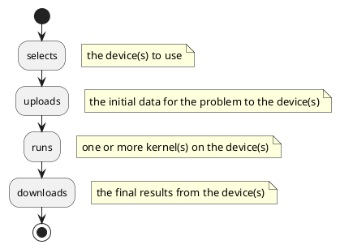

# Program Flow
The typical GPGPU program follows this structure:

```plantuml
@startuml
start
:selects;
floating note right:the device(s) to use
:uploads;
floating note right:the initial data for the problem to the device(s)
:runs;
floating note right:one or more kernel(s) on the device(s)
:downloads;
floating note right:the final results from the device(s)
stop
@enduml
```
