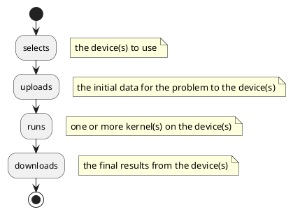

# GPGPU Program Flow
The typical GPGPU program follows this structure:



and is divided in two parts

```ad-def
title:Host code
collapse:true

runs on the CPU (starting from `main()`), manages the resources, handles I/O, tells the device(s) to run kernels;
```

```ad-def
collapse:true
title:Device code

collection of kernels that are uploaded to the device(s), issued by the host code.
```

that can be from the same source or from different sources

```ad-def
collapse:true
title:single source

the same source code holds both the host and the device code; requires a specific compiler to produce an executable that includes both the host and device part of the program;


Pro

- less code to write;
- consistency between host and device data types;

Con

- needs specific compiler (harder toolchain integration, e.g. for MPI);
- specific compiler may not support all host compilers;
- compiles only for specific device(s);
- ‘selective compile’ of device code impossible.
```

```ad-def
collapse:true
title:separate source

host code sources are separate from device code sources; host code is produced by (any) host compiler (`gcc`, `clang`, `msvc`, `icc`, etc), device code is produced by a distinct library, offline (before program execution) or at run-time.

Pro

- can use any host compiler (easy to integrate in existing toolchains);
- compiles for any device (and only the one used);
- possibility to select kernels to compile at runtime;

Con

- more code to write (to compile and run kernels);
- care must be taken to preserve consistency between host and device for complex data types.

```
